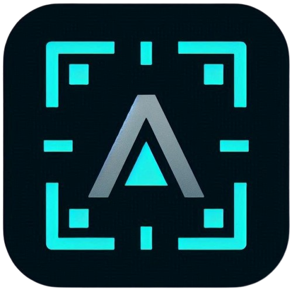

<div align="center">

  

# Alliulingo

**The Ultra-Fast, Private AI Screen Translator for Windows**

[](https://www.gnu.org/licenses/gpl-3.0)
[](https://www.microsoft.com/windows)
[](https://isocpp.org/)
[](https://www.qt.io/)

---

[🚀 Download](https://github.com/alliumur/alliulingo/releases/latest) | [🐛 Report Bug](https://github.com/alliumur/alliulingo/issues) | [💡 Request Feature](https://github.com/alliumur/alliulingo/issues)

</div>

## 📖 About

**Alliulingo** is an efficient Windows desktop application designed for instant on-screen text translation and extraction. Simply press a global hotkey, select any screen area, and get context-aware, AI-powered translations in seconds. It is ideal for gaming, reading foreign documentation, or browsing international content.

### Key Features

- **🖥️ Screen OCR** – Capture and recognize text from any screen area (powered by Tesseract OCR)
- **🤖 AI Translation** – Connect to local offline models (via LM Studio) or external cloud APIs (Google AI Studio, OpenAI, Groq)
- **🌐 Basic Mode** – Free online translation (via the MyMemory API) with zero configuration required
- **✍️ Manual Translation** – A dedicated window for typing and translating text manually
- **📝 Prompt System** – Configurable translation profiles tailored for different domains (gaming, tech docs, literature)
- **🎯 Special Prompts** – Additional context-specific text analysis (explanations, term definitions, acronym expansion)
- **🌍 10 Languages** – Multi-language OCR support (English, Polish, German, French, Spanish, Italian, Russian, Portuguese, Czech, Ukrainian)
- **🔒 Privacy First** – Fully offline mode available (local OCR + local AI models)
- **⚡ Lightning Fast** – Lightweight and optimized C++17/Qt6 architecture

---

## ⌨️ Keyboard Shortcuts

| Shortcut            | Action                            |
| :------------------ | :-------------------------------- |
| **Shift + Alt + X** | Capture screen area and translate |
| **Shift + Alt + C** | Copy screen text to clipboard     |
| **Shift + Alt + Z** | Open manual translation window    |

---

## 🎯 Features in Detail

### Screen OCR Translation

Recognizes and translates text from a selected screen area:

1. Press **Shift + Alt + X**
2. The screen freezes and the semi-transparent selection overlay appears
3. Drag your mouse to select the target text area
4. Release the mouse button — the application immediately recognizes and translates the text
5. The result appears in a floating, styled popup window near your cursor

**Cancel:** Press **ESC** at any time to close the overlay without translating.

### OCR Copy Mode

Recognizes text on your screen and copies it directly to the clipboard, bypassing translation:

1. Press **Shift + Alt + C**
2. Select the target text area
3. The recognized text is instantly copied to your clipboard

### Manual Translation

Opens a dedicated window in the bottom-right corner of your screen for manual text entry:

1. Press **Shift + Alt + Z**
2. Type or paste your text into the upper text field
3. Select your preferred source and target languages using the side buttons
4. Press **Ctrl + Enter** or click "Translate"
5. The translation appears in the lower text field

**Note:** The manual translation window maintains its own language settings, independent of the global **Shift + Alt + X** shortcut.

### Translation Methods

#### Basic (MyMemory)

- Free online translation API
- Requires zero configuration
- Works immediately after installation
- Best for general use, though has limited quality for highly specialized terminology

#### Advanced (AI)

- Connects to local offline models (LM Studio) or external cloud APIs (Google AI Studio, Groq, etc.)
- Requires configuration via a prompt profile (e.g., `Default.txt`, `Distant_Worlds_2.txt`)
- Outstanding translation quality
- Configurable profiles tailored for different domains, games, or technical fields

**How to switch modes:**

1. Right-click the Alliulingo tray icon
2. Select **"Translation Method"**
3. Choose **"Basic (MyMemory)"** or **"Advanced (AI)"**

---

## ⚙️ Configuration

### Prompt Profiles (prompts/\*.txt)

Each `.txt` file in the `prompts/` directory acts as a translation profile. You can create multiple profiles for different games, technical documents, or literature.

**File structure:**

```ini
[LLM]
# API endpoint
endpoint=http://127.0.0.1:1234/v1/chat/completions

# API key (optional for local models)
api_key=

# Model name
model=google/gemma-4-e4b

# Creativity parameter (0.0 - 2.0, recommended 0.2 for precise translations)
temperature=0.2

[Translator]
# System prompt / instructions for the AI model
skill="Translate from [sLang] to [tLang]. You are a professional strategy game translator. Keep proper names, abbreviations, and technical terms untranslated."

# Optional prefix prepended before the user text
userContentPrefix=Following text is from the game interface:
```

**Dynamic parameters:**

- `[sLang]` – automatically replaced with the selected source language code (e.g., `eng`, `pol`)
- `[tLang]` – automatically replaced with the selected target language code (e.g., `eng`, `pol`)

#### Supported Language Codes for `[sLang]` and `[tLang]`:

| Language   | Code  |
| :--------- | :---: |
| English    | `eng` |
| Polish     | `pol` |
| Czech      | `ces` |
| German     | `deu` |
| French     | `fra` |
| Italian    | `ita` |
| Portuguese | `por` |
| Russian    | `rus` |
| Spanish    | `spa` |
| Ukrainian  | `ukr` |

**Example skill for gaming:**

```
skill="Translate from [sLang] to [tLang]. You are a strategy game translator. Keep unit names, buildings, and technologies untranslated. Use gaming terminology."
```

**Example skill for technical documentation:**

```
skill="Translate from [sLang] to [tLang]. You are a technical documentation translator. Keep programming terms in English. Translate literally, without interpretation."
```

### Special Prompts (#\*.txt)

Files starting with `#` (e.g., `#WIKI.txt`, `#Explanation.txt`) are special prompts accessible from the menu button inside the translation result window.

**Use cases:**

- Acronym and abbreviation expansion
- Deep-dive term explanations
- Cultural or lore context
- General knowledge inquiries

**How to use:**

1. After translating text (Shift + Alt + X), the result window appears
2. Click the menu button (**≡**) in the top-right corner of the popup
3. Select your desired special prompt from the list
4. The window shows "Analyzing..." and sends the text back to the AI with the new instructions
5. The analysis result replaces the initial translation in the same window

**Example `#WIKI.txt`:**

```ini
[LLM]
endpoint=http://127.0.0.1:1234/v1/chat/completions
model=google/gemma-4-e4b
temperature=0.3

[Translator]
skill="Analyze the following text and provide additional wiki-style information: term meanings, story context, or mechanics. Reply in [tLang] language."
```

_Note: Special prompts are only available in Advanced (AI) mode._

### Selecting a Prompt Profile

1. Right-click the tray icon
2. Select **"AI Translator Settings"**
3. Choose a profile from the list
4. The profile is loaded and used for the next translation

**Prompt management:**

- **"Open prompts folder"** – opens the `prompts/` directory in File Explorer
- **"Edit active prompt"** – opens the active configuration file in Notepad

---

## 💡 Use Cases & Examples

### Gaming Translation

1. Run your game in windowed or borderless fullscreen mode.
2. Press **Shift + Alt + X**.
3. Select the screen area containing the dialogue or item description.
4. Read the translated text instantly in the popup window.
5. (Optional) Click the menu button (**≡**) and select a special prompt (e.g., "Acronyms") to expand abbreviations.

### Strategy Game Prompt Configuration

Create a custom profile file named `prompts/Distant Worlds 2.txt`:

```ini
[LLM]
endpoint=http://127.0.0.1:1234/v1/chat/completions
model=google/gemma-4-e4b
temperature=0.2

[Translator]
skill="Translate from [sLang] to [tLang]. You are a Distant Worlds 2 game translator. Keep names: races, planets, ships, technologies, and resources untranslated. Use 4X gaming terminology (explore, expand, exploit, exterminate)."

userContentPrefix=Text from the Distant Worlds 2 interface:
```

Once created, simply select this profile from the **"AI Translator Settings"** tray menu.

### Using Special Prompts

Create a special prompt file named `prompts/#Acronyms.txt`:

```ini
[LLM]
endpoint=http://127.0.0.1:1234/v1/chat/completions
model=google/gemma-4-e4b
temperature=0.3

[Translator]
skill="Expand all abbreviations and acronyms in the following text. Explain their meaning in the game's context. Reply in [tLang] language."
```

After translating any text containing gaming abbreviations (such as "DPS" or "AoE"), click the menu button (**≡**) in the popup window and select **"Acronyms"** to get a detailed breakdown.

---

## 🔒 Privacy & Security

- **Local OCR Processing** – Text recognition (Tesseract) runs entirely locally on your machine.
- **Offline Mode** – While Basic mode (MyMemory) requires an internet connection, Advanced mode can work fully offline when connected to LM Studio.
- **No Telemetry** – The application does not collect or transmit any analytics, crash logs, or usage statistics.
- **Open Source** – The entire source code is available for public audit.
- **Your Data Stays Yours** – When using local offline models, captured text never leaves your system.

---

## 🛠️ Building from Source

### Prerequisites

- **MSYS2** (UCRT64 environment)
- **Qt 6.x** (Widgets, Gui, Network modules)
- **Tesseract OCR** & Leptonica
- **CMake** & Ninja

### Build Steps

1. Clone the repository:

```bash
git clone https://github.com/alliumur/alliulingo.git
cd alliulingo
```

2. Install dependencies (inside MSYS2 UCRT64 terminal):

```bash
pacman -S --needed \
    mingw-w64-ucrt-x86_64-gcc \
    mingw-w64-ucrt-x86_64-qt6-base \
    mingw-w64-ucrt-x86_64-qt6-tools \
    mingw-w64-ucrt-x86_64-tesseract-ocr \
    mingw-w64-ucrt-x86_64-cmake \
    mingw-w64-ucrt-x86_64-ninja \
    mingw-w64-ucrt-x86_64-pkgconf
```

3. Compile the application:

```bash
_build.bat
```

The compiled executable will be placed in the `build/` directory.

---

## ❓ FAQ

**Q: Does it work on Linux or macOS?**  
A: Currently, Windows 10/11 is the only supported platform. Cross-platform support is planned for the future.

**Q: Can I use OpenAI or Claude API instead of LM Studio?**  
A: Yes, just change the `endpoint` URL and add your `api_key` in the prompt `.txt` file. Any OpenAI-compatible API is supported.

**Q: Does it work with fullscreen games?**  
A: Yes, though "Borderless Windowed" mode in games is recommended for the most seamless overlay experience.

**Q: How much does it cost?**  
A: The application is free and open-source. API costs depend on your chosen provider (local LM Studio is completely free and offline).

**Q: Can I create custom translation profiles?**  
A: Absolutely! Simply create new `.txt` files in the `prompts/` directory with your custom system instructions.

---

## ❤️ Support the Project

If Alliulingo helped you enjoy a game or speed up your daily work, consider supporting development:

- ⭐ **Star this repository** on GitHub.
- 🐛 **Report bugs** or suggest new features in the [Issues](https://github.com/alliumur/alliulingo/issues) tab.
- 🤝 **Contribute** – Pull requests are welcome!

<div align="center">
  <a href="https://buymeacoffee.com/alliumur" target="_blank">
    
  </a>
</div>

---

## 📄 License

This project is licensed under the GNU General Public License v3.0 - see the [LICENSE](LICENSE.txt) file for details.

---

<div align="center">

**Developed with ❤️ by Maksymilian Renkiewicz**

[GitHub](https://github.com/alliumur) | [Issues](https://github.com/alliumur/alliulingo/issues)

</div>
